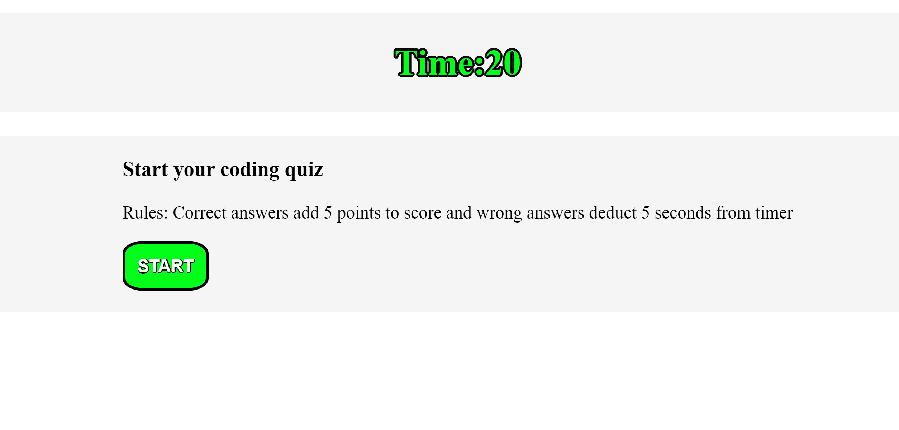
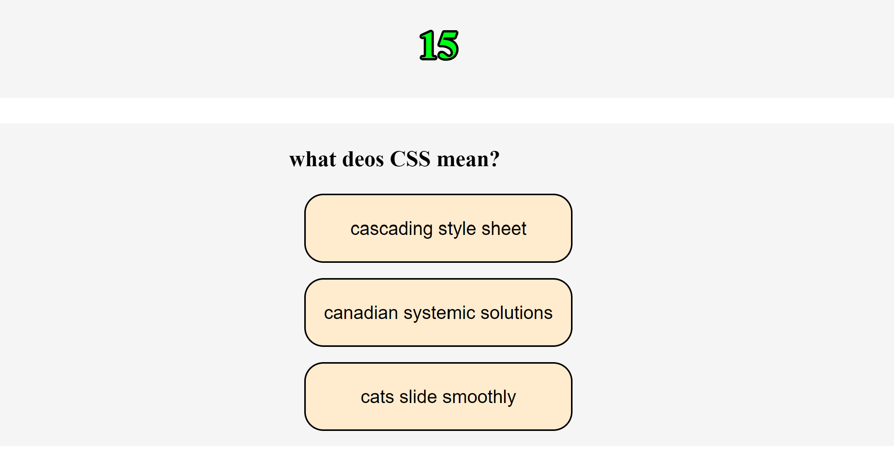
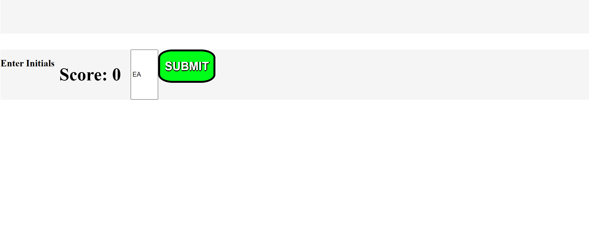
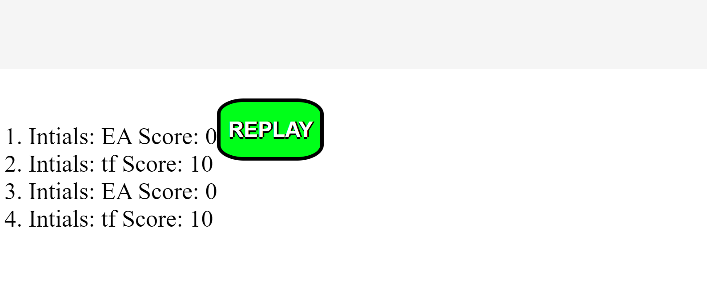
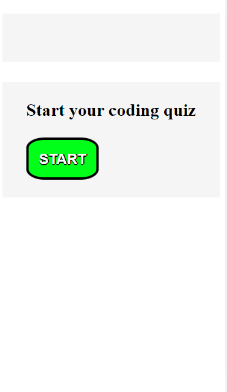
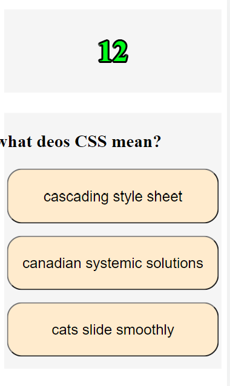
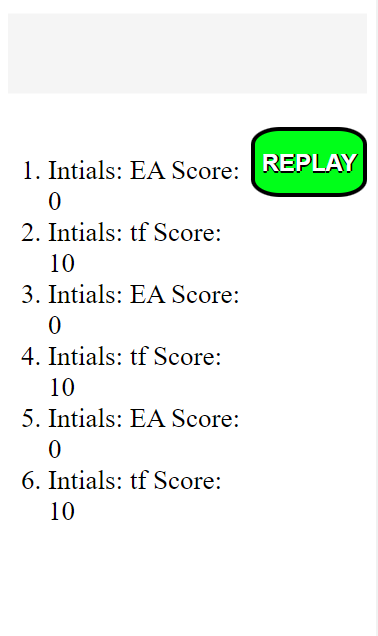

# Coding Knowledge Quiz
## Deployed Page
https://esrawameed.github.io/prework-study-guide/

## Description
This app was created to assist students and professionals in reviewing their coding knowledge through answering a variety of different coding related questions and choosing the best fitting answer. Once users click on the start button, the quiz begins and they are presented with the questions and answer options. For each correct answer selection, the user will gain an extra 5 points to their initial score or 0. If the user selects the incorrect choice, 5 seconds will be deducted from the timer. 

Users past attempts will be stored in their local storage alongside their initials for them to refer back to their progress and keep track of it. 
## features
- Count-down timer
- Multiple choice questions
- score tracker
- score and initial storage (local)
- Ability to replay
## Technologies Used
- HTML: to display page and page strucute.
- CSS: to style the quiz.
- javaScript: to add functionality through DOM manipulation

## Deployed Application
https://esrawameed.github.io/Coding-Knowledge-Quiz-Game/
## Laptop View
### Image 1

### Image 2

### Image 3

### Image 4

## iPhone View
### Image 5

### Image 6

### Image 7

